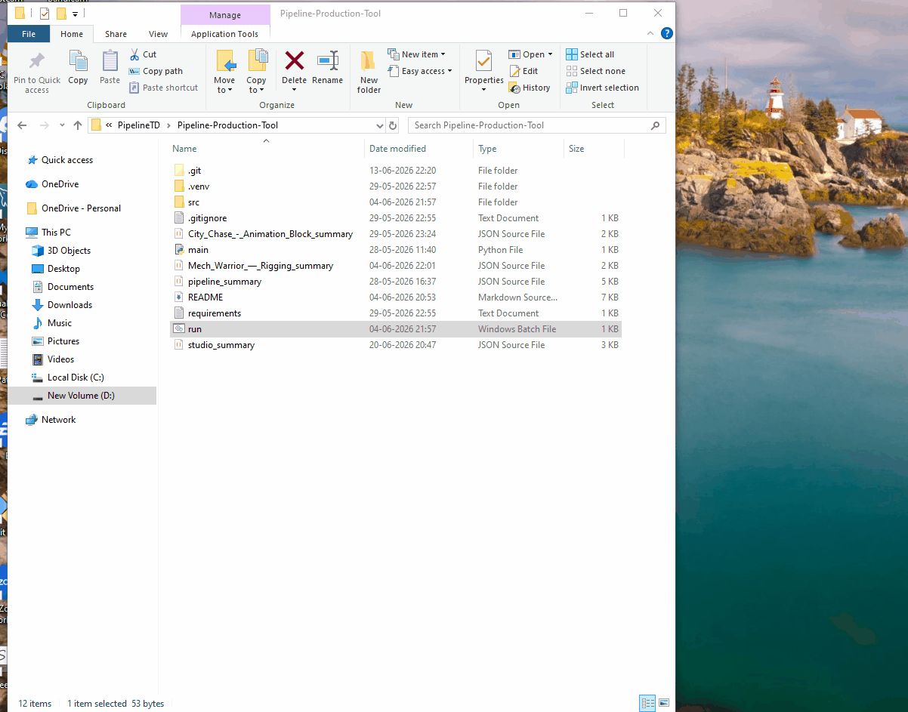
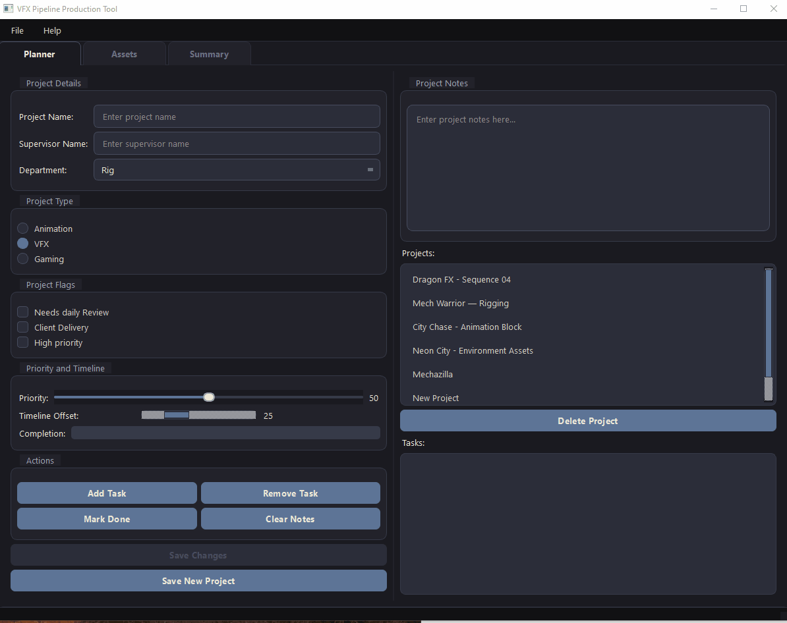
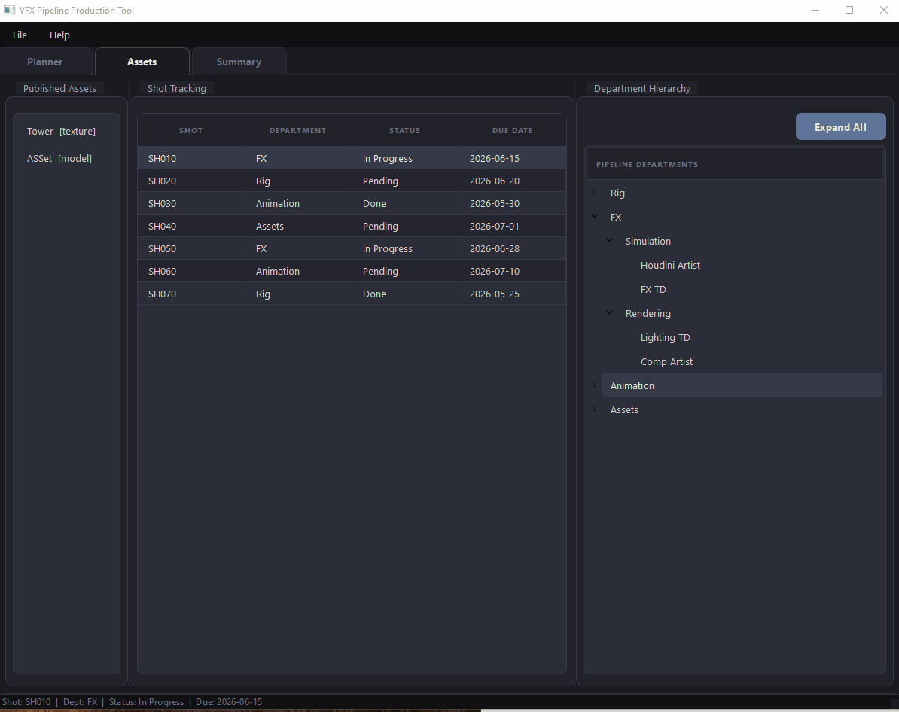

# VFX Pipeline Production Tool

A modular PySide2 desktop application for managing VFX projects, tasks, shot tracking, and assets with full JSON persistence.

**Author:** Seemanshu Verma  
**Version:** 0.1.0

---

## Features

### Tab 1 — Planner
- Create, edit, and delete **projects** with name, supervisor, department, and project type (Animation / VFX / Gaming)
- Set project **flags**: Needs Daily Review, Client Delivery, High Priority
- **Priority slider** — auto-saves on release
- **Timeline Offset scrollbar** — auto-saves on release
- **Completion progress bar** — read-only, auto-calculated from actual task statuses
- **Add / Remove tasks** per project
- **Mark Done** for individual tasks
- **Project Notes** text area with Clear Notes action
- **Save Changes** button for bulk field edits
- Formatted task list: `ProjectName  |  Department  |  TaskName  |  status`

### Tab 2 — Assets
- **Published Assets** panel — lists all assets stored in `production.json`
- **Shot Tracking** table — Shot, Department, Status, Due Date; seeded with 7 default shots and persisted in `production.json`
- **Department Hierarchy** tree — Pipeline department / sub-group / role structure
  - Toggle button to **Collapse All / Expand All** the entire tree

### Tab 3 — Summary
Two collapsible sections:

**Project Summary**
- Per-project details: name, supervisor, department, type, created date
- Priority, Completion, and Timeline Offset progress bars
- Task breakdown: total, pending, in-progress, done
- Active flags display
- **Export Project Summary as JSON**

**Studio Summary**
- Studio-wide totals: projects, tasks by status, assets
- Breakdown by project type (VFX / Animation / Gaming) and department
- Studio-wide flag counts
- Overall studio completion bar
- **Export Studio Summary as JSON**

---

## GIF Walkthrough

### Planner Tab


### Assets Tab


### Summary Tab


---

## Project Structure

```
Pipeline-Production-Tool/
├── main.py                        # Entry point
├── requirements.txt               # Python dependencies
├── README.md
└── src/
    ├── app.py                     # App init — loads stylesheet, launches window
    ├── constants.py               # All app-wide constants (paths, defaults, domain lists)
    ├── data_manager.py            # JSON persistence layer (projects, tasks, assets, shots)
    ├── data/
    │   ├── Project.json           # Persistent project + task storage
    │   └── production.json        # Persistent asset + shot storage
    ├── models/
    │   └── data_models.py         # Dataclasses: Project, Task, Asset, Shot
    ├── resources/
    │   └── style.qss              # App-wide dark ink-wash stylesheet
    └── ui/
        ├── main_window.py         # Main window — tab widget, menu bar, file I/O
        ├── planner_tab.py         # Tab 1 — project/task management
        ├── assets_tab.py          # Tab 2 — assets, shot tracking, dept hierarchy
        └── summary_tab.py         # Tab 3 — per-project and studio-wide statistics
```

---

## Setup

### Prerequisites

- Python 3.10 or higher
- pip

### Installation

```bash
# 1. Clone the repository
git clone https://github.com/seemanshu10/Pipeline-Production-Tool.git
cd Pipeline-Production-Tool

# 2. Create and activate a virtual environment
python -m venv .venv
.venv\Scripts\activate        # Windows
# source .venv/bin/activate   # macOS / Linux

# 3. Install dependencies
pip install -r requirements.txt
```

### Running

```bash
python main.py
```

---

## Data Storage

Data is split across two JSON files inside `src/data/`, both created automatically on first run.

| File | Contents |
|------|----------|
| `src/data/Project.json` | All projects and their tasks |
| `src/data/production.json` | All assets and shots |

Shot tracking is seeded with 7 default shots on first launch; any edits persist across restarts.

### Project.json structure
```json
{
  "projects": [
    {
      "id": "proj_abc1",
      "name": "Dragon FX",
      "supervisor_name": "Jane Smith",
      "department": "FX",
      "project_type": "VFX",
      "needs_daily_review": true,
      "client_delivery": false,
      "high_priority": true,
      "priority": 80,
      "timeline_offset": 30,
      "completion": 0,
      "notes": "Client review on Friday.",
      "created_date": "2026-05-28",
      "tasks": [
        {
          "id": "task_001",
          "name": "Simulate smoke",
          "status": "in-progress",
          "priority": "high",
          "created_date": "2026-05-28"
        }
      ]
    }
  ]
}
```

### production.json structure
```json
{
  "assets": [
    {
      "id": "asset_001",
      "name": "Dragon_Rig_v3",
      "type": "model",
      "created_date": "2026-05-28"
    }
  ],
  "shots": [
    {
      "id": "shot_001",
      "shot": "SH010",
      "department": "FX",
      "status": "In Progress",
      "due_date": "2026-06-15"
    }
  ]
}
```

### Task statuses
`pending` · `in-progress` · `done`

### Asset types
`model` · `texture` · `animation` 

### Shot statuses
`Pending` · `In Progress` · `Done`

---

## Usage Guide

### Planner Tab

1. Fill in project details on the left panel and click **New Project** to create one.
2. Select a project from the **Projects** list on the right to load its details.
3. Use **Add Task** / **Remove Task** to manage the task queue.
4. Click **Mark Done** to complete a selected task — the Completion bar updates automatically.
5. Click **Save Changes** to persist any form edits (name, department, flags, notes).
6. **File → New Project (Ctrl+N)** clears the form ready for a fresh entry.

### Assets Tab

- The **Published Assets** panel reflects assets in `production.json`.
- The **Shot Tracking** table is read from `production.json` and refreshes on tab switch.
- Use the **Collapse All / Expand All** toggle to navigate the Department Hierarchy tree.

### Summary Tab

- Both sections collapse/expand via their header buttons.
- Select a project from the dropdown to view its per-project stats.
- Statistics update every time you switch to this tab.
- Use the export buttons to save JSON snapshots for reporting or handoff.

### File Menu

- **Open Project (Ctrl+O)** — loads any `Project.json` file and replaces the current session.
- **Save Project (Ctrl+S)** — writes the current session to a new JSON file of your choice.

---

## Dependencies

| Package | Version |
|---------|---------|
| PySide2 | 5.15.13 |

Python standard library only beyond PySide2 (`json`, `uuid`, `datetime`, `pathlib`, `os`).
